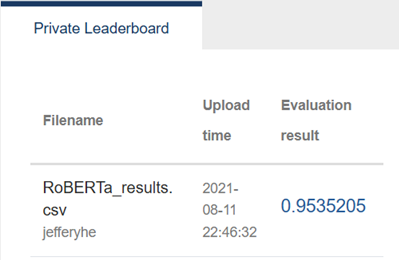

# Sentiment Classification on Movie Reviews

A sentiment classifier built for the **AIdea Topic List competition**: [https://aidea-web.tw/topic/285ef3be-44eb-43dd-85cc-f0388bf85ea4](https://aidea-web.tw/topic/285ef3be-44eb-43dd-85cc-f0388bf85ea4)

## Result

Ranking: **Top 8%** (26 / 327 teams)

## What It Does

Fine-tunes a pretrained transformer model with long-text handling to classify movie reviews as positive or negative.

## Core Techniques

**Model:**

* SiEBERT (a sentiment-optimized RoBERTa-large model)

**Input Handling:**

* Analyze token-length distribution across reviews
* Apply token-length normalization to stabilize performance across variable-length reviews
* Truncate sequences at 350 tokens while preserving proper sequence termination

**Preprocessing:**

* Clean text (HTML removal, punctuation normalization, contraction expansion)

**Fine-tuning Setup:**

* PyTorch + HuggingFace
* AdamW optimizer + linear learning rate decay
* Stratified train/validation split

## Tech Stack

* Python, PyTorch
* HuggingFace Transformers
* NumPy, Pandas, Scikit-learn
